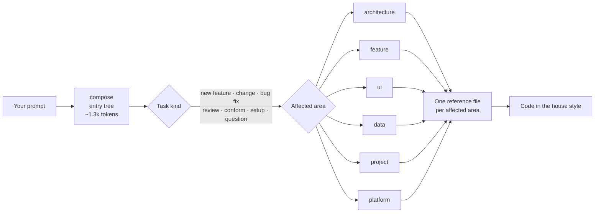

<div align="center">

# Compose Kit

**Agent skills that make AI coding models write better Jetpack Compose and Compose Multiplatform code.**<br>
Seven skills, one consistent house style, measured on five models in real agent CLIs.

[](https://github.com/Meet-Miyani/compose-skill/releases)
[](https://github.com/Meet-Miyani/compose-skill/actions/workflows/ci.yml)
[](LICENSE)
[](#whats-inside)
[](#results-held-out-v5)
[](tests/skills)
[](#roadmap)

**Works with** Claude Code · Codex · Cursor · OpenCode · Copilot · Gemini CLI · Antigravity

</div>

<table>
<tr>
<td align="center" width="25%"><h2>+25.6</h2>points for<br><b>Gemini 3.8 Flash</b><br>with the kit</td>
<td align="center" width="25%"><h2>+18.6</h2>points for<br><b>Sonnet 5.5</b><br>with the kit</td>
<td align="center" width="25%"><h2>120</h2>agentic runs<br>on 8 never-seen tasks</td>
<td align="center" width="25%"><h2>2</h2>blind graders from other vendors<br>must agree on every item</td>
</tr>
</table>

<p align="center">
  <picture>
    <source media="(prefers-color-scheme: dark)" srcset="docs/assets/v5-kit-lift-dark.svg">
    
  </picture>
</p>

## Why

AI agents write Compose that compiles and then drifts: state ends up in the wrong place, every screen gets its own
pattern, error handling changes from file to file, and reviews flag perfectly fine code as blocking. Compose Kit gives
the agent one house style plus the reasoning behind it, and only loads the parts the current task needs.

- **One consistent style:** MVI on a shared `BaseViewModel` contract, Koin annotations, Navigation 3,
  feature-owned data/domain/presentation layers, and typed error handling.
- **Progressive loading:** a ~1.3k-token entry tree picks the task path and the exact reference files. The full kit
  is about 127k tokens; in the v5 test, 35 of 40 kit runs loaded under 20k.
- **Respects your project:** in a coherent existing codebase (Hilt, MVVM, Navigation 2, your own base class), the
  kit follows your pattern and proposes migration separately.
- **Checked, not trusted:** 11 shell guard scripts catch drift in CI, backed by 90 fixture tests.

## What's inside

| Skill | What it owns |
|---|---|
| **`compose`** | The entry decision tree (~1.3k tokens): task kind → affected area → exact reference files |
| `compose-architecture` | Module graph, MVI/`BaseViewModel` contract, error tiers, state ownership, naming, Koin DI, Navigation 3, coroutines |
| `compose-feature` | A screen or feature slice end to end: contract, ViewModel, UI, navigation, DI and tests; review mode |
| `compose-ui` | Composables: Route/Screen split, stability, loading/empty/error states, lists, animation, accessibility, resources |
| `compose-data` | Repositories, Ktor, Room, DataStore, Paging 3, offline-first, data-layer tests |
| `compose-project` | New projects, adopting the kit, modules, convention plugins, version catalog, CI and agent hooks |
| `compose-platform` | `commonMain` vs `expect`/`actual`, iOS/Swift interop, desktop and web targets, platform lifecycle |

Also included: project and feature templates, and the guard scripts (`compose-architecture/scripts/`).

## How it works



## Install

Install all seven skills. `compose` is the entry point, and it hands each task to the other six.

Every option below can install for **one project** (lives in the repo, so your team gets it too) or **globally** (for
you, in every project on your machine).

### npx skills

Needs Node 22.20+. Works with Claude Code, Codex, Cursor, OpenCode, Copilot, Gemini CLI, Antigravity and 70+ other agents.

```sh
# This project only (run it in the repo root)
npx skills add Meet-Miyani/compose-skill --skill '*' -a claude-code

# Globally, for every project
npx skills add Meet-Miyani/compose-skill --skill '*' -a claude-code -g
```

Swap `claude-code` for your agent: `codex`, `cursor`, `opencode`, `github-copilot`, `gemini-cli`, `antigravity`. Repeat
`-a` to install for several at once. Leave it out and you get an interactive picker.

| Agent | This project | Global |
|---|---|---|
| Claude Code | `.claude/skills/` | `~/.claude/skills/` |
| Codex, Cursor, OpenCode, Copilot, Gemini CLI, Antigravity | `.agents/skills/` | the agent's own folder, e.g. `~/.codex/skills/` |

### gh skill

Needs GitHub CLI 2.90+. Pass `--pin`: without it, `gh skill` takes the latest *stable* release, which is still the old
v5.1.0. Pass `--agent` too: without it, a non-interactive run installs for GitHub Copilot.

```sh
for s in compose compose-architecture compose-feature compose-ui compose-data compose-project compose-platform; do
  gh skill install Meet-Miyani/compose-skill "$s" --pin v6.0.0-preview.1 --agent claude-code --scope project
done
```

Use `--scope user` to install globally. Agent IDs: `claude-code`, `codex`, `cursor`, `opencode`, `gemini-cli`,
`antigravity`, `github-copilot`.

### Claude Code plugin

```text
/plugin marketplace add Meet-Miyani/compose-skill
/plugin install compose-kit@compose-kit
```

From a terminal, the same with a scope: `user` (the default, every project), `project` (shared through the repo) or
`local` (this project, just you).

```sh
claude plugin marketplace add Meet-Miyani/compose-skill
claude plugin install compose-kit@compose-kit --scope project
```

### Codex plugin

```sh
codex plugin marketplace add Meet-Miyani/compose-skill
codex plugin add compose-kit@compose-kit
```

Codex plugins install for your user, so they're available in every project.

### Then point your agent at it

Add this line to the project's `AGENTS.md` or `CLAUDE.md`:

```text
Compose/CMP work: load the compose skill first; it picks the path and the files to read.
```

The skills also trigger on their own; the line just makes sure the entry tree loads first.

**Coming from the old single `compose` skill (v5.x or the `composekit` CLI)?** Delete the old `compose` folder from
your agent's skills directory, then install with any option above. The old CLI's `update` can't fetch v6.

**Optional:** install the guard scripts into a project to catch drift in CI:

```sh
bash <skills dir>/compose-architecture/scripts/install-guards.sh <project>
```

## Results: held-out v5

This is the test v6.0.0-preview.1 shipped on. Five models got 8 tasks they had never seen, in a fresh app, inside
their own agent CLIs. Each task ran three times: with no kit, with a short generic "senior engineer" prompt, and with
the kit. That's 120 runs. Two models from the other vendors graded every answer blind, and an item only counts if
both of them pass it. The rules were written down before the tasks existed, and the grades were frozen before
anything was scored.

| Model | No kit | Generic prompt | **With the kit** | Kit − no kit | Verdict |
|---|---:|---:|---:|---:|---|
| Gemini 3.8 Flash | 51.2% | 46.5% | **76.7%** | **+25.6** | ✅ Recommended |
| Sonnet 5.5 | 55.8% | 60.5% | **74.4%** | **+18.6** | ✅ Recommended |
| Opus 5.5 | 65.1% | 62.8% | **74.4%** | **+9.3** | ✅ Recommended (see erratum) |
| GPT-6-Sol | 72.1% | 74.4% | **76.7%** | +4.6 | ➖ Neutral: within noise |
| GPT-6-Luna | 65.1% | 60.5% | 67.4% | +2.3 | ❌ Not yet: engineering items fell (−11.1) |
| *Muse Spark 1.3 (add-on)* | *58.1%* | *62.8%* | *60.5%* | *+2.4* | *No lift* |

- **House-style items** rose for every model, from 37-50% without the kit to 56-69% with it.
- **On engineering-only items,** Sonnet (+11.1) and Flash (+40.8) beat the generic prompt by 8+ points; for Opus,
  Sol and Luna a short generic prompt does about as well.

By task type, all five panel models together (both graders agree):

| Task type | No kit | Generic prompt | With the kit | |
|---|---:|---:|---:|---|
| New features (3 tasks) | 43.5% | 47.1% | **70.6%** | The biggest win: where data lives, navigation results, background work |
| Bug fixes (2) | 80.0% | 88.6% | 82.9% | Every setup fixed the bugs; the kit adds little here |
| Reviews (2) | 72.9% | 64.3% | **84.3%** | These two tasks had flawed setups, see the erratum below |
| "Match our conventions" (1) | 68.0% | 60.0% | 44.0% | Worse with the kit: models restructured too much. This is the main v6.1 fix |

Computed from the frozen grades by [`v5-by-task-type.py`](evals-v2/method/tools/v5-by-task-type.py).

> **Erratum (2026-10-01).** Two review tasks had flawed setups. No pre-registered outcome changes, but Opus's +9.3
> depends on those two tasks (+3.4 without them). The Claude model was Sonnet 5.5, first published as "Sonnet 5".
> Details: [VERDICT.md](evals-v2/results-v5/VERDICT.md#erratum-2026-10-01).

<p align="center">
  <picture>
    <source media="(prefers-color-scheme: dark)" srcset="docs/assets/v5-kit-context-dark.svg">
    
  </picture>
</p>

Every panel model opened `compose` first on every task. Kit context is an upper bound (the full size of every kit
file opened). Details: [kit-tokens.txt](evals-v2/results-v5/kit-tokens.txt).

## How we test

- **New tasks every round.** A separate model writes them in a new app domain without ever seeing the kit, and they're
  sealed before the first run.
- **A gate, not a promise.** A script builds every task's setup and runs its hidden behaviour tests. Tasks that fail
  the gate or a manual content check go back to the author or get repaired, and every repair is written down.
- **Real agents on a real app.** Claude Code, Codex, Antigravity and OpenCode, each driving its own model headless on
  a Kotlin Multiplatform project.
- **Blind, cross-vendor grading.** Answers are shuffled and stripped of anything that gives away the model or the
  setup. Two graders from the other vendors score each one.
- **Pre-registered.** Pass/fail rules come before the tasks, grades are frozen before scoring, and mistakes get a
  public erratum.

Method and tools: [evals-v2/method](evals-v2/method/) · Results: [evals-v2/results-v5](evals-v2/results-v5/) ·
Tasks and base app: [evals-v2/heldout-v5](evals-v2/heldout-v5/)

### Testing so far

| Round | Domain | Format | What it showed |
|---|---|---|---|
| v1-v2 | Habits, expenses | Single-shot scenarios | The early kit made models lecture and over-escalate reviews, and engineering on new tasks fell (83% → 72%). Fixed. |
| v3 | Workout log | 8 single-shot scenarios, 2 graders | Muse Spark 1.3: 54% → 91% with the kit; DeepSeek V4.1 Flash: 57% → 77% *(earlier candidate)* |
| v4 | Plant care | 12 scenarios | Fed the redesign into 7 skills with an entry tree (results not published) |
| **v5** | **Workout log** | **8 agentic tasks, 150 runs incl. add-ons** | **The results above: release evidence for v6.0** |
| v6 | Reading log | 6 agentic tasks, 90 runs | In progress: v6.0 vs v6.1 vs no kit (see [roadmap](#roadmap)) |

Checks on the kit itself:
- **Guard precision on a real app:** run read-only on a ~1,600-file production KMP codebase, the guard scripts went
  from 539 hits (527 false) to 12 hits, all true.
- **Templates build:** following the bootstrap guide literally gave a zero-patch build for Android, desktop and iOS,
  and 36/36 scaffolded tests passed *(earlier candidate)*.

## Roadmap

- [x] **v6.0.0-preview.1:** 7 skills, entry tree, 4 install channels *(released 2026-10-01)*
- [ ] **v6.1 A/B, in progress:** v6.0 vs the v6.1 fixes vs no kit, 5 models × 6 new tasks = 90 runs. The fixes
  target conform over-restructuring, over-strict reviews and over-reading.
  - 84/90 runs done and blind grading under way (as of Oct 2)
  - verdict expected around **Oct 5**, once the last grader's plan quota resets
  - **v6.1.0-preview.2** ships only if the pre-registered rules hold: no model worse, conform improves, reviews
    over-flag no more
- [ ] **Cheap-model benchmark:** the same tasks on DeepSeek V4.1 Flash, DeepSeek V4 Pro and MiniMax M3, then Kimi K3,
  GLM and Qwen if plan quota allows
- [ ] **Promote v6 to "Latest"** on GitHub once v6.1 is confirmed (until then `gh skill` needs `--pin`)
- [ ] **A project site** with the full test history
- [ ] *Maybe:* a kit CLI for project tooling (new project, add feature, run guards), if users ask for it

After v6 and the cheap-model benchmark, new benchmark rounds start only for a concrete reason: a reported problem, a
major new model, or a large change to the kit.

## Known issues in v6.0

- On "make this match our conventions" tasks, the kit can lead models to restructure too much *(v6.1 fix under test)*.
- Reviews sometimes call fine code blocking *(v6.1 fix under test)*.
- GPT-6-Luna scored lower on engineering items with the kit in v5.
- New features can exceed 20k kit tokens when a model reads past the entry tree.
- Installing only some of the skills isn't supported yet; skills cross-reference each other, so install all 7.

## Feedback

Found a problem, or want a model benchmarked? [Open an issue](https://github.com/Meet-Miyani/compose-skill/issues).
A reported problem is exactly what kicks off the next test round.

## License

MIT, see [LICENSE](LICENSE). Attribution for the external sources used in the kit is in [NOTICE.md](NOTICE.md).
