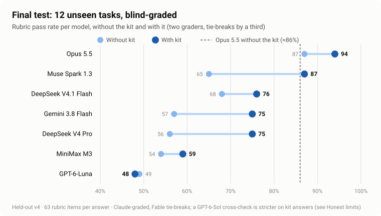
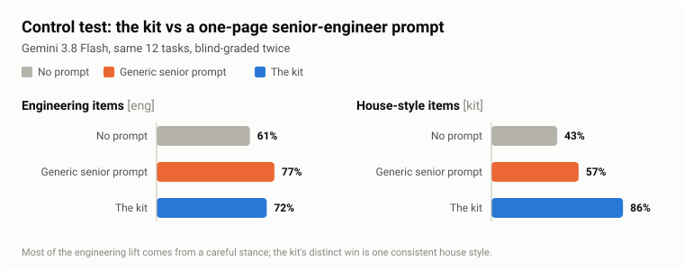
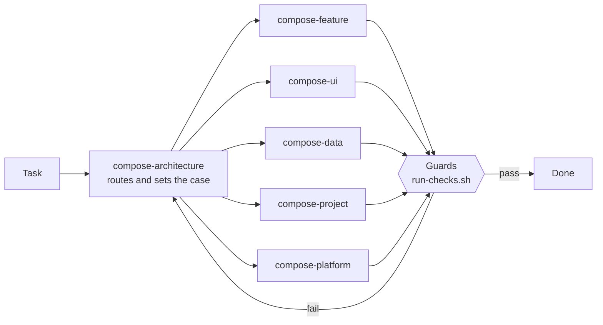

<div align="center">

# Compose Kit

**Six agent skills that teach AI coding agents one house architecture for Jetpack Compose and Compose Multiplatform apps: MVI on one BaseViewModel, Koin annotations, Navigation 3 and one error contract.**


[What it is](#what-it-is) · [Results](#results) · [Honest limits](#honest-limits) · [The six skills](#the-six-skills) · [Quick start](#quick-start) · [How it was tested](#how-it-was-tested)

</div>

---

## What it is

An opinionated, strict **house kit** for agents such as Claude Code, Codex, Gemini/Antigravity, Cursor and
OpenCode. It is not a Compose tutorial. It teaches the kit's decisions, the non-obvious failures, and the
workflow, and it ships templates and checks for applying them:

| | |
|---|---|
| 🧭 **Rules with reasons** | Each rule says what it prevents, so an agent can apply it to a case the rule never named. |
| 🧱 **Templates** | A feature scaffold and project templates; one moderator-assembled project was reported to build, while clean bootstrap from the distributed artifact remains unverified. |
| 🛡️ **Guards** | Shell checks for layering, contracts, error handling, hardcoded colours, locale parity and more. CI and hook integration is provided; enforcement coverage is not established. |
| 🗂️ **Routing** | `compose-architecture` gives routing instructions. Native activation and routing reliability have not been established. |

The house stack: **MVI** on one `BaseViewModel` contract · **Koin** annotations · **Navigation 3** ·
feature-owned `data` / `domain` / `presentation` · typed error tiers · `kotlin.time.Instant` · Kotlin 2.4,
CMP 1.12, AGP 9.

---

## Results

> [!NOTE]
> The scores below describe the **v4 candidate, adjudicated two-pass grading** at `ef9e499`:
> 12 plant-care tasks answered with and without the kit, scored against a 63-item checklist in two blind
> grading passes with tie adjudication. This limited answer set does not establish repeatable lift or general
> capability parity.

The kit has changed since v4 (fix rounds 4-6); these scores describe the v4 candidate only.
The table covers seven completed paired endpoints. Development runs, partial runs and reference-only answers
are separate; the badge makes no vendor-count claim.

<p align="center">
  
</p>

| Model | Without the kit | With the kit | Higher v4 rubric score? ¹ | Within 5 rubric points? ² |
|---|---:|---:|:---:|:---:|
| Opus 5.5 | 87% | **94%** | ✅ | — |
| Muse Spark 1.3 | 65% | **87%** | ✅ | ✅ ³ |
| DeepSeek V4.1 Flash | 68% | **76%** | ✅ | ❌ |
| Gemini 3.8 Flash | 57% | **75%** | ✅ | ❌ |
| DeepSeek V4 Pro | 56% | **75%** | ✅ | ❌ |
| MiniMax M3 | 54% | **59%** | ✅ small ⁴ | ❌ |
| GPT-6-Luna | 49% | 48% | ❌ | ❌ |

<sub>All scores: v4 candidate, adjudicated two-pass grading at `ef9e499`. ¹ Higher on this answer set under
the stated rubric; not a repeatability claim. ² Within 5 rubric points of the Opus 5.5 no-kit answers on these
tasks; not capability equivalence. ³ See the tuning caveat under [Honest limits](#honest-limits). ⁴ MiniMax had a
small lift after adjudication (pass A was a tie before adjudication).</sub>

### What the kit changes most

- **Pressure-task answers:** On two tasks asking for `GlobalScope` or database photo BLOBs, both v4 grading
  passes accepted Gemini's **0/4 → 4/4** and Luna's **0/4 → 4/4** rubric outcomes. Other runs recorded unsafe
  scope substitutions, so these scores do not establish a broad safety effect.
- **Feature-answer checklist:** On the "care log screen" task, Gemini rose from **2/7 → 7/7** selected items.
  The text included a contract, error path, retry, draft and tests; runtime lifecycle and process-death behavior
  was not established by that score.
- **House conformity:** Gemini's house-style items rose from **43% to 86%** on this v4 answer set. Consistency
  across projects has not been measured.

### Kit vs a good generic prompt

<p align="center">
  
</p>

In one Gemini 3.8 Flash control panel, a **one-page "act as a senior Android engineer" prompt** scored higher
on general engineering items (**77% vs 72%**); the kit scored higher on house-style items (**86% vs 57%**)
and overall (**75% vs 72%**). These are v4 candidate, adjudicated two-pass grading scores at `ef9e499`.
The panel does not isolate a general kit effect or show that every project follows one style.

---

## Honest limits

> [!IMPORTANT]
> These are measured, not guessed. Each one has a finding id in the project's review log.

- **Hard rules sometimes override good judgement.** Opus with the kit blocked a review over a hardcoded string;
  two DeepSeek models refused `GlobalScope` and then ran the work on the screen's own scope, because the kit bans
  one without teaching the app-wide alternative; MiniMax and Luna stopped to ask for files instead of building.
- **Some common topics are thin:** local notifications, adaptive list-detail layouts, background work, and
  non-network failures (storage, validation).
- **Bug fixes don't force a regression test.** Opus with the kit wrote one; weaker models did not.
- **Muse was the model used most while developing the kit.** Authorship effects remain unresolved; its
  within-five-points result is limited to this rubric and answer set.
- **The grading leans Claude.** Most grading was done by Claude models. A limited GPT-6-Sol cross-check on 18
  packets (3 per model) agreed 84% item by item; it kept the kit ahead for Muse, DeepSeek V4 Pro and Opus, and
  put it one item behind for Gemini and DeepSeek V4.1 Flash. Grader effects remain unresolved; this sample
  cannot bound the true effect.
- **Pending:** Kimi K3's final-test run and Muse's generic-prompt run wait for a plan reset. Qwen 3.8 Max and
  GLM 5.3 were tested on an earlier round only.

---

## The six skills

| Skill | Loads when the task… |
|---|---|
| `compose-architecture` | Writes, changes or reviews any Kotlin in a Compose/CMP project. **Loads first**: decides the owning skill and the existing-project case. Owns the module graph, MVI contract, error tiers, state ownership, naming, Koin, Navigation 3 and code craft. |
| `compose-feature` | Adds, changes or reviews a screen, sheet, dialog or destination end to end: Contract → ViewModel → Route/Screen → DI/nav → tests. |
| `compose-ui` | Touches `@Composable` code: Route/Screen/leaf split, state reads, lists, motion, accessibility, tokens, resources, images, focus. |
| `compose-data` | Touches repositories, data sources or mapping: DTO → domain → UiModel, Ktor, Room, DataStore, Paging 3, offline-first. |
| `compose-project` | Touches project or build shape: bootstrap, adopting an existing project, new modules, convention plugins, version catalog, CI and hooks. |
| `compose-platform` | Touches platform splits: `commonMain` placement, `expect`/`actual` vs interface + DI, iOS/Swift, desktop, web. |



Each skill has a `When NOT to use` table pointing to related skills. Some rules appear in more than one place;
the routing instructions and native activation have not been independently verified.

---

## Quick start

**1. Install the guards into your project**

```sh
skills-v2/compose-architecture/scripts/install-guards.sh <project-root>
```

This copies the checks to `<root>/scripts/composekit/`, writes `.composekit.conf` if it is absent, and prints the
CI job and agent-hook snippets (shapes in `compose-project/references/enforcement.md`). `run-checks.sh` is the one
entry point CI and hooks call.

**2. Scaffold a feature**

```sh
skills-v2/compose-feature/scripts/new-feature.sh --name Notes --item Note \
  --package com.example.feature.notes --root <project-root>
```

It emits the contract, ViewModel, Route, Screen, NavKey, DI module and a state-matrix test. The project templates
in `compose-project/templates/` give a composition root. A moderator-assembled project was reported to build
for Android, desktop and iOS and to survive rotation on an emulator; clean bootstrap from the distributed kit
remains unverified.

**3. Activate the kit** with the one-line pointer and optional SessionStart hook from
`compose-project/references/enforcement.md`, and record your choices under `## Project decisions` (below).

<details>
<summary><b>Existing projects</b></summary>

1. New project, module or feature: the kit, strictly.
2. A coherent different architecture (Hilt, MVVM, Navigation 2, its own base class): follow the project's pattern
   for the change at hand. Never mix two patterns in one feature. State the divergence and propose migration
   separately.
3. An incoherent project: use the kit for new code, name the incoherence, and propose migration separately.
4. Precedent is evidence, not permission.

</details>

<details>
<summary><b>Project decisions</b></summary>

Each rule is labelled **non-negotiable** or **default**. Defaults and conditionals (UiModel triggers, scaffold
switches, optional layers) yield to an owner decision recorded in the project's `## Project decisions` section
(`AGENTS.md` / `CLAUDE.md`; machine-readable switches in `.composekit.conf`) with no argument. Non-negotiables
hold against in-chat pushes and are waived only by a recorded, reasoned decision, marked as a known deviation.

</details>

<details>
<summary><b>Optional depth</b></summary>

The kit is self-sufficient. These external skills go deeper if installed; none is required:

- android/skills: `navigation-3`, `styles`, `adaptive`, `agp-9-upgrade`
- skydoves: `diagnosing-compose-stability`
- Kotlin/kotlin-agent-skills: `kotlin-tooling-java-to-kotlin`, `kotlin-tooling-agp9-migration`,
  `kotlin-tooling-cocoapods-spm-migration`, `kotlin-tooling-immutable-collections-0-5-x-migration`

</details>

---

## How it was tested

<details>
<summary><b>Method, in short</b></summary>

- **Development:** the v4 candidate was written and reviewed through three practice test sets and three fix
  rounds. Later fix rounds changed the kit after the v4 answers were examined.
- **V4 candidate test:** 12 scenarios in a new domain, 63 checklist items (49 general engineering, 14 house
  style), including two "pressure" tasks that ask for a harmful shortcut and one code review.
- **Grading:** blind, shuffled packets with both frontier references (Opus 5.5 and GPT-6-Astra, no kit) in every
  packet; two independent Claude passes; Fable 5.1 broke ties on 75 split items; GPT-6-Sol re-graded 18 packets as
  a cross-vendor check. All claim rules were written down before any answer was read.
- **Control:** the same tasks with a one-page generic senior-engineer prompt instead of the kit.
- **Review and build record:** Fable 5.1 found 2 blockers and 8 majors, followed by maintainer-reported fixes,
  builds, tests and an emulator launch for one assembled project. A later independent review found further defects;
  independent clean-bootstrap reproduction is pending.

</details>

Built from the legacy `skills/compose` skill and an owner's production app; attribution in [`NOTICE.md`](NOTICE.md).
