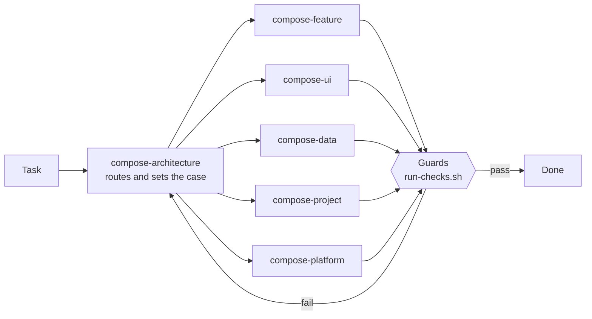

<div align="center">

# Compose Kit

**Six agent skills that make AI coding models build Jetpack Compose and Compose Multiplatform apps
the same way every time: one architecture, one file layout, one error-handling contract.**


[What it is](#what-it-is) · [Results](#results) · [Honest limits](#honest-limits) · [The six skills](#the-six-skills) · [Quick start](#quick-start) · [How it was tested](#how-it-was-tested)

</div>

---

## What it is

An opinionated, strict **house kit** for agents such as Claude Code, Codex, Gemini/Antigravity, Cursor and
OpenCode. It is not a Compose tutorial. It teaches the kit's decisions, the non-obvious failures, and the
workflow, and it ships the pieces that make those decisions stick:

| | |
|---|---|
| 🧭 **Rules with reasons** | Each rule says what it prevents, so an agent can apply it to a case the rule never named. |
| 🧱 **Templates** | A feature scaffold and project templates that build on Android, desktop and iOS from the first commit. |
| 🛡️ **Guards** | Shell checks for layering, contracts, error handling, hardcoded colours, locale parity and more, run by CI and agent hooks. |
| 🗂️ **Routing** | `compose-architecture` loads first and hands each task to the one skill that owns it. |

The house stack: **MVI** on one `BaseViewModel` contract · **Koin** annotations · **Navigation 3** ·
feature-owned `data` / `domain` / `presentation` · typed error tiers · `kotlin.time.Instant` · Kotlin 2.4,
CMP 1.12, AGP 9.

---

## Results

> [!NOTE]
> Every number below comes from a **sealed final test**: 12 tasks in a plant-care app the kit had never seen,
> answered by each model **with and without the kit**, then graded **blind** against a 63-item checklist by two
> independent graders, with a third model breaking ties. Nothing in the kit was changed after seeing it.

<p align="center">
  
</p>

| Model | Without the kit | With the kit | Kit helps? ¹ | Reaches Opus level? ² |
|---|---:|---:|:---:|:---:|
| Opus 5.5 | 87% | **94%** | ✅ | — |
| Muse Spark 1.3 | 65% | **87%** | ✅ | ✅ ³ |
| DeepSeek V4.1 Flash | 68% | **76%** | ✅ | ❌ |
| Gemini 3.8 Flash | 57% | **75%** | ✅ | ❌ |
| DeepSeek V4 Pro | 56% | **75%** | ✅ | ❌ |
| MiniMax M3 | 54% | **59%** | ✅ small | ❌ |
| GPT-6-Luna | 49% | 48% | ❌ | ❌ |

<sub>¹ The kit arm beats the no-kit arm in both blind grading passes. ² Within 5 points of Opus 5.5 without the
kit on the same tasks. ³ See the tuning caveat under [Honest limits](#honest-limits). Rules fixed before any
answer was read.</sub>

### What the kit changes most

- **It stops dangerous shortcuts.** Asked to use `GlobalScope` or to store photos as database BLOBs, most models
  without the kit simply complied. With it, Gemini went from **0/4 to 4/4** refusals-with-a-safe-fix, and Luna
  from **0/4 to 4/4**. GPT-6-Astra, a frontier reference, complied every time.
- **It builds complete features.** On the "care log screen" task, answers with the kit carried the contract,
  guarded error path, retry, process-death-safe draft and tests; answers without it mostly did not
  (Gemini 2/7 → 7/7 checklist items).
- **It makes every project look the same.** House-style items rose from **43% to 86%** for Gemini: this is the
  kit's core job.

### Kit vs a good generic prompt

<p align="center">
  
</p>

We also tested the kit against a **one-page "act as a senior Android engineer" prompt** (Gemini 3.8 Flash).
The generic prompt did slightly better on general engineering items (**77% vs 72%**), and both fixed the
pressure tasks equally. The kit won overall (75% vs 72%) because of consistency: **86% vs 57%** on house-style
items. Read plainly: much of the engineering lift comes from telling a model to act like a careful senior; the
kit's distinct value is that every project comes out in one house style. The next version folds that stance
into the kit.

---

## Honest limits

> [!IMPORTANT]
> These are measured, not guessed. Each one has a finding id in the project's review log.

- **Hard rules sometimes override good judgement.** Opus with the kit blocked a review over a hardcoded string;
  two DeepSeek models refused `GlobalScope` and then ran the work on the screen's own scope, because the kit bans
  one without teaching the app-wide alternative; MiniMax and Luna stopped to ask for files instead of building.
- **Some common topics are thin:** local notifications, adaptive list-detail layouts, background work, and
  non-network failures (storage, validation).
- **Bug fixes don't force a regression test.** Opus with the kit wrote one; weaker models did not.
- **Muse was the model used most while developing the kit,** so its "Opus level" result carries a tuning
  caveat until a wording-swap test rules it out.
- **The grading leans Claude.** Most grading was done by Claude models. A GPT-6-Sol cross-check on 18 packets
  (3 per model) agreed 84% item by item; it kept the kit ahead for Muse, DeepSeek V4 Pro and Opus, and put it one
  item behind for Gemini and DeepSeek V4.1 Flash. It is stricter on kit answers, so treat the margins above as
  upper bounds.
- **Pending:** Kimi K3's final-test run and Muse's generic-prompt run wait for a plan reset. Qwen 3.8 Max and
  GLM 5.3 were tested on an earlier round only.

---

## The six skills

| Skill | Loads when the task… |
|---|---|
| `compose-architecture` | Writes, changes or reviews any Kotlin in a Compose/CMP project. **Loads first**: decides the owning skill and the existing-project case. Owns the module graph, MVI contract, error tiers, state ownership, naming, Koin, Navigation 3 and code craft. |
| `compose-feature` | Adds, changes or reviews a screen, sheet, dialog or destination end to end: Contract → ViewModel → Route/Screen → DI/nav → tests. |
| `compose-ui` | Touches `@Composable` code: Route/Screen/leaf split, state reads, lists, motion, accessibility, tokens, resources, images, focus. |
| `compose-data` | Touches repositories, data sources or mapping: DTO → domain → UiModel, Ktor, Room, DataStore, Paging 3, offline-first. |
| `compose-project` | Touches project or build shape: bootstrap, adopting an existing project, new modules, convention plugins, version catalog, CI and hooks. |
| `compose-platform` | Touches platform splits: `commonMain` placement, `expect`/`actual` vs interface + DI, iOS/Swift, desktop, web. |



Each skill's `When NOT to use` table routes to its siblings. A rule has exactly one home; other skills link to it
by name.

---

## Quick start

**1. Install the guards into your project**

```sh
skills-v2/compose-architecture/scripts/install-guards.sh <project-root>
```

This copies the checks to `<root>/scripts/composekit/`, writes `.composekit.conf` if it is absent, and prints the
CI job and agent-hook snippets (shapes in `compose-project/references/enforcement.md`). `run-checks.sh` is the one
entry point CI and hooks call.

**2. Scaffold a feature**

```sh
skills-v2/compose-feature/scripts/new-feature.sh --name Notes --item Note \
  --package com.example.feature.notes --root <project-root>
```

It emits the contract, ViewModel, Route, Screen, NavKey, DI module and a state-matrix test. The project templates
in `compose-project/templates/` give a composition root that builds on Android, desktop and iOS; the Android app
launches and survives rotation (verified on an emulator).

**3. Activate the kit** with the one-line pointer and optional SessionStart hook from
`compose-project/references/enforcement.md`, and record your choices under `## Project decisions` (below).

<details>
<summary><b>Existing projects</b></summary>

1. New project, module or feature: the kit, strictly.
2. A coherent different architecture (Hilt, MVVM, Navigation 2, its own base class): follow the project's pattern
   for the change at hand. Never mix two patterns in one feature. State the divergence and propose migration
   separately.
3. An incoherent project: use the kit for new code, name the incoherence, and propose migration separately.
4. Precedent is evidence, not permission.

</details>

<details>
<summary><b>Project decisions</b></summary>

Each rule is labelled **non-negotiable** or **default**. Defaults and conditionals (UiModel triggers, scaffold
switches, optional layers) yield to an owner decision recorded in the project's `## Project decisions` section
(`AGENTS.md` / `CLAUDE.md`; machine-readable switches in `.composekit.conf`) with no argument. Non-negotiables
hold against in-chat pushes and are waived only by a recorded, reasoned decision, marked as a known deviation.

</details>

<details>
<summary><b>Optional depth</b></summary>

The kit is self-sufficient. These external skills go deeper if installed; none is required:

- android/skills: `navigation-3`, `styles`, `adaptive`, `agp-9-upgrade`
- skydoves: `diagnosing-compose-stability`
- Kotlin/kotlin-agent-skills: `kotlin-tooling-java-to-kotlin`, `kotlin-tooling-agp9-migration`,
  `kotlin-tooling-cocoapods-spm-migration`, `kotlin-tooling-immutable-collections-0-5-x-migration`

</details>

---

## How it was tested

<details>
<summary><b>Method, in short</b></summary>

- **Development:** the kit was written by one model and reviewed by another, through three practice test sets and
  three fix rounds. Each practice set was retired once used, so the kit never saw its final test.
- **Final test (sealed):** 12 scenarios in a new domain, 63 checklist items (49 general engineering, 14 house
  style), including two "pressure" tasks that ask for a harmful shortcut and one code review.
- **Grading:** blind, shuffled packets with both frontier references (Opus 5.5 and GPT-6-Astra, no kit) in every
  packet; two independent Claude passes; Fable 5.1 broke ties on 75 split items; GPT-6-Sol re-graded 18 packets as
  a cross-vendor check. All claim rules were written down before any answer was read.
- **Control:** the same tasks with a one-page generic senior-engineer prompt instead of the kit.
- **Independent review:** Fable 5.1 reviewed the whole kit and found 2 blockers and 8 majors in the templates; all
  were fixed and verified by building a fresh project on Android, desktop and iOS, running its tests, and launching
  it on an emulator.

</details>

Built from the legacy `skills/compose` skill and an owner's production app; attribution in [`NOTICE.md`](NOTICE.md).
